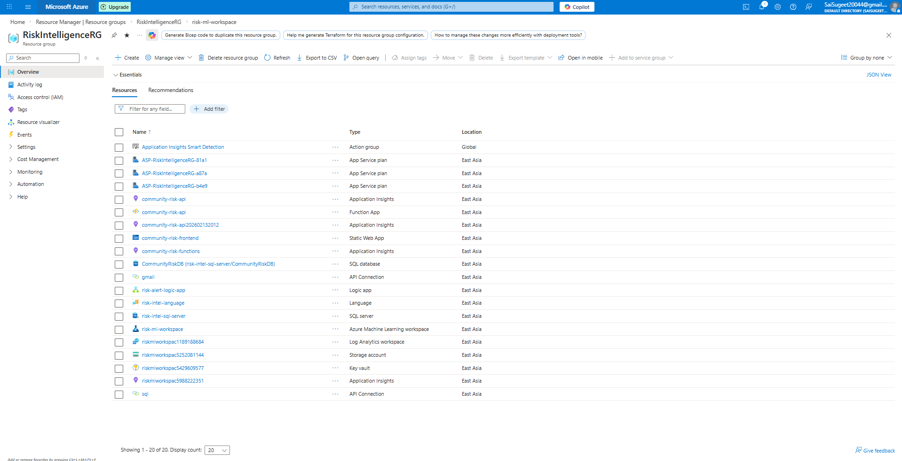
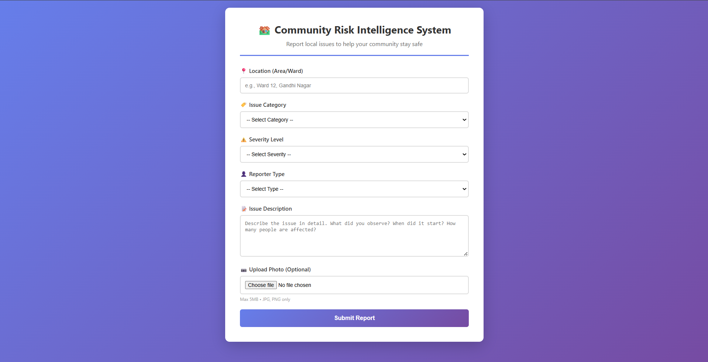
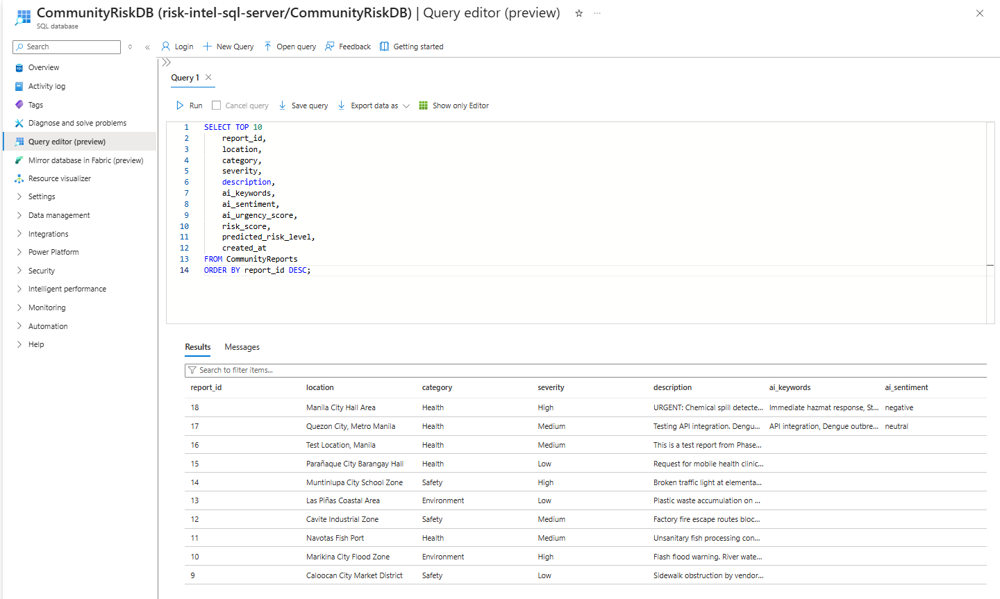
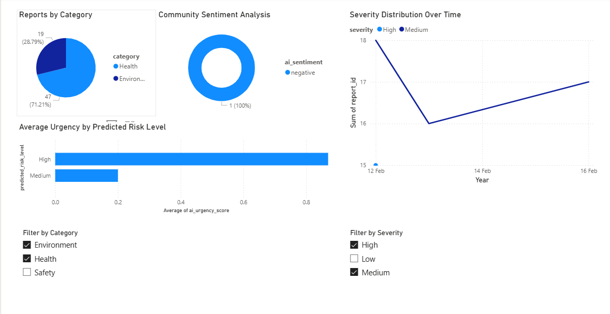
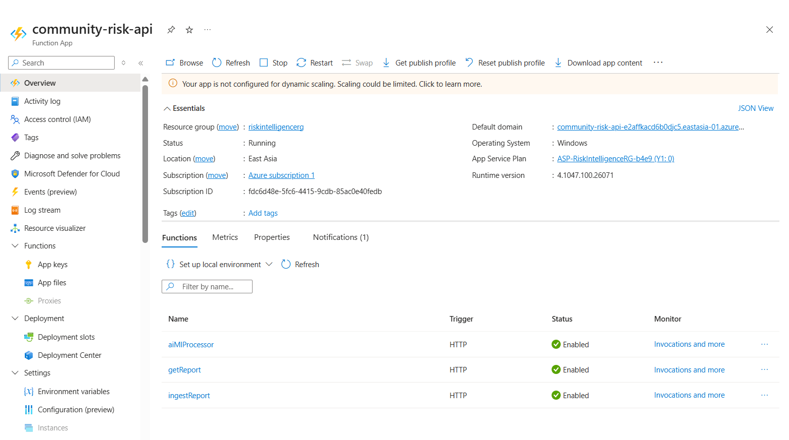

# Azure Community Risk Intelligence System

> **Cloud-Based AI & ML-Powered Community Risk Intelligence Platform**

A comprehensive end-to-end cloud solution built on Microsoft Azure that enables NGOs and communities to report, analyze, and predict local risks using AI-powered text analytics and intelligent risk scoring.

[](https://azure.microsoft.com/)
[](https://wonderful-beach-0957aaa00.6.azurestaticapps.net)
[](LICENSE)

**🔗 Live Demo:** [https://wonderful-beach-0957aaa00.6.azurestaticapps.net](https://wonderful-beach-0957aaa00.6.azurestaticapps.net)

---

## 📋 Table of Contents

- [Problem Statement](#-problem-statement)
- [Solution Overview](#-solution-overview)
- [System Architecture](#-system-architecture)
- [Tech Stack](#-tech-stack)
- [Features](#-features)
- [Project Structure](#-project-structure)
- [Deployment Guide](#-deployment-guide)
- [Phase Execution Summary](#-phase-execution-summary)
- [Demo & Screenshots](#-demo--screenshots)
- [Learning Outcomes](#-learning-outcomes)
- [Future Enhancements](#-future-enhancements)
- [Contributing](#-contributing)
- [License](#-license)

---

## 🎯 Problem Statement

NGOs and community organizations face critical challenges in managing local risks:

- **❌ No Centralized Reporting System** - Issues reported through fragmented channels (phone, email, social media)
- **❌ Delayed Risk Response** - Manual processing leads to slow reaction times for urgent issues
- **❌ No Predictive Insights** - Inability to identify emerging patterns or high-risk areas
- **❌ Manual Data Tracking** - Spreadsheet-based systems prone to errors and inefficiency
- **❌ Poor Prioritization** - Difficulty determining which reports require immediate attention

---

## ✅ Solution Overview

This project delivers a **cloud-native, AI-powered platform** that:

✅ **Collects** community reports through a web-based form  
✅ **Stores** data securely in Azure SQL Database  
✅ **Analyzes** report text using Azure AI Language services (sentiment, keywords, urgency)  
✅ **Predicts** risk levels using intelligent scoring algorithms  
✅ **Visualizes** insights through Power BI dashboards  
✅ **Alerts** stakeholders automatically via Azure Logic Apps  

**Built entirely on Azure free-tier services** - demonstrating enterprise-grade solutions with zero infrastructure costs.

---

## 🏗️ System Architecture

```
┌─────────────────────────────────────────────────────────────────────┐
│                        USER INTERACTION LAYER                        │
│                   Web Form (HTML/CSS/JavaScript)                     │
└────────────────────────────────┬────────────────────────────────────┘
                                 │
                    ┌────────────▼────────────┐
                    │  Azure Static Web Apps  │
                    │  (Frontend Hosting)     │
                    └────────────┬────────────┘
                                 │
                    ┌────────────▼────────────────────────┐
                    │     Azure Functions (Serverless)    │
                    │  ┌──────────────────────────────┐  │
                    │  │  1. ingestReport (POST)      │  │
                    │  │  2. getReport (GET)          │  │
                    │  │  3. aiMLProcessor (POST)     │  │
                    │  └──────────────────────────────┘  │
                    └────────────┬────────────────────────┘
                                 │
                    ┌────────────▼────────────┐
                    │   Azure SQL Database    │
                    │   (CommunityRiskDB)     │
                    │   • 18 sample reports   │
                    │   • AI/ML fields        │
                    └────────────┬────────────┘
                                 │
            ┌────────────────────┼────────────────────┐
            │                    │                    │
┌───────────▼──────────┐  ┌──────▼─────────┐  ┌──────▼──────────┐
│ Azure AI Language    │  │  ML Risk       │  │  Power BI       │
│ • Sentiment Analysis │  │  Scoring       │  │  Dashboard      │
│ • Keyword Extraction │  │  • Weighted    │  │  • 4 Visuals    │
│ • Urgency Detection  │  │    Algorithm   │  │  • Filtering    │
└──────────────────────┘  └────────────────┘  └─────────────────┘
                                 │
                    ┌────────────▼────────────┐
                    │   Azure Logic Apps      │
                    │   (Automated Alerts)    │
                    │   • Every 15 minutes    │
                    │   • Email notifications │
                    └─────────────────────────┘
```

---

## 🛠️ Tech Stack

### **Frontend**
- **HTML5/CSS3/JavaScript** - Responsive web form
- **Azure Static Web Apps** - Global CDN hosting with automatic HTTPS

### **Backend**
- **Azure Functions** - Serverless API (Node.js 18)
  - `ingestReport` - Accepts and stores community reports
  - `getReport` - Retrieves reports for Power BI/testing
  - `aiMLProcessor` - AI/ML analysis pipeline

### **Database**
- **Azure SQL Database** - Relational data storage (General Purpose - Serverless, Gen5, 1 vCore)
- **SQL Authentication** - Secure credential management

### **AI/ML Services**
- **Azure AI Language** (Text Analytics)
  - Sentiment Analysis
  - Key Phrase Extraction
  - Custom urgency scoring
- **Rule-Based ML Model** (Embedded in Azure Functions)
  - Weighted risk scoring algorithm
  - Category, severity, sentiment, urgency-based predictions
  - Risk classification (High/Medium/Low)

### **Analytics & Visualization**
- **Power BI Desktop** - Interactive dashboard with 4 visualizations
  - Risk distribution charts
  - Category breakdown
  - Geographic insights
  - Trend analysis

### **Automation**
- **Azure Logic Apps** - Scheduled risk monitoring
  - Recurrence trigger (every 15 minutes)
  - SQL query for high-risk reports
  - Email alerts via Gmail connector

### **DevOps & Version Control**
- **GitHub** - Source code repository
- **Git** - Version control
- **Azure Portal** - Resource management

---

## ⚡ Features

### **1. Community Reporting Portal**
- User-friendly web form for submitting health, environmental, and safety issues
- Fields: Location, Category, Severity, Reporter Type, Description
- Real-time submission to cloud backend

### **2. AI-Powered Text Analysis**
- **Sentiment Detection:** Identifies negative/positive/mixed/neutral tone
- **Keyword Extraction:** Automatically tags reports with relevant phrases
- **Urgency Scoring:** Calculates priority based on sentiment confidence

### **3. Intelligent Risk Prediction**
- **Multi-Factor Scoring:** Combines category, severity, AI urgency, and sentiment
- **Weighted Algorithm:**
  - Severity: High (40pts), Medium (25pts), Low (10pts)
  - Category: Health (30pts), Environmental (25pts), Safety (20pts), Infrastructure (15pts), Social (10pts)
  - AI Urgency: 0-30 points (dynamic)
  - Sentiment: Negative (+10pts), Mixed (+5pts), Neutral (0pts), Positive (-5pts)
- **Risk Levels:** High (≥70), Medium (40-69), Low (<40)

### **4. Interactive Dashboards**
- Real-time Power BI visualizations connected to Azure SQL
- Filters by category, location, risk level, date range
- Visual insights for decision-making

### **5. Automated Alert System**
- Monitors database every 15 minutes for high-risk reports
- Sends email notifications to stakeholders
- Configurable thresholds and recipients

### **6. Failover & Reliability**
- AI processing errors don't crash the system (default values applied)
- Database connection retry logic
- Error logging in Azure Functions

---

## 📁 Project Structure

```
Azure-Community-Risk-Intelligence/
│
├── frontend/                         # Static web app files
│   ├── index.html                    # Main reporting form
│   ├── style.css                     # Responsive styling
│   ├── script.js                     # Form validation & API calls
│   └── README.md                     # Frontend documentation
│
├── backend/                          # Azure Functions backend
│   └── azure-functions/
│       ├── ingestReport/             # POST endpoint for new reports
│       │   └── index.js
│       ├── getReport/                # GET endpoint for retrieving reports
│       │   └── index.js
│       └── aiMLProcessor/            # AI/ML analysis pipeline
│           └── index.js              # Sentiment, keywords, risk scoring
│
├── database/                         # SQL schema & sample data
│   ├── schema.sql                    # CommunityReports table definition
│   └── sample-data.sql               # 18 Philippine NGO sample reports
│
├── powerbi/                          # Power BI dashboard files
│   ├── dashboard-design.md           # Dashboard documentation
│   └── screenshots/                  # Dashboard images
│
├── docs/                             # Phase-by-phase documentation
│   └── phases/
│       ├── phase-0-environment.md    # Parrot OS setup
│       ├── phase-1-structure.md      # GitHub initialization
│       ├── phase-2-frontend.md       # Web form development
│       ├── phase-3-azure-infra.md    # Static Web Apps deployment
│       ├── phase-4-database.md       # Azure SQL setup
│       ├── phase-5-functions.md      # Serverless backend
│       ├── phase-6-ai.md             # AI Language integration
│       ├── phase-7-ml.md             # ML risk scoring
│       ├── phase-8-powerbi-alerts.md # Dashboards & automation
│       └── phase-9-finalization.md   # Documentation & GitHub polish
│
├── .gitignore                        # Excludes node_modules, secrets
└── README.md                         # This file
```

---

## 🚀 Deployment Guide

### **Prerequisites**
- Azure Account (Free Tier)
- GitHub Account
- Node.js 18.x
- Azure CLI (optional)
- Power BI Desktop

### **Quick Start (30 minutes)**

#### **1. Clone Repository**
```bash
git clone https://github.com/YOUR_USERNAME/Azure-Community-Risk-Intelligence.git
cd Azure-Community-Risk-Intelligence
```

#### **2. Deploy Frontend**
- Fork this repository to your GitHub account
- Create Azure Static Web App in Azure Portal
- Connect to your GitHub repository (`frontend/` folder)
- Azure automatically builds and deploys on push

#### **3. Deploy Database**
- Create Azure SQL Database (General Purpose - Serverless)
- Run `database/schema.sql` to create tables
- Run `database/sample-data.sql` to populate test data
- Configure firewall to allow Azure services

#### **4. Deploy Azure Functions**
- Create Azure Function App (Node.js 18, Consumption Plan)
- Deploy functions from `backend/azure-functions/`
- Configure Application Settings:
  ```
  SQL_SERVER=<your-server>.database.windows.net
  SQL_DATABASE=CommunityRiskDB
  SQL_USER=<admin-user>
  SQL_PASSWORD=<password>
  AI_LANGUAGE_ENDPOINT=<ai-endpoint>
  AI_LANGUAGE_KEY=<ai-key>
  ```

#### **5. Configure AI Services**
- Create Azure AI Language resource (Free tier: F0)
- Copy endpoint and key to Function App settings

#### **6. Set Up Power BI Dashboard**
- Open Power BI Desktop
- Connect to Azure SQL Database using SQL Authentication
- Import `CommunityReports` table
- Create visualizations (refer to `powerbi/dashboard-design.md`)

#### **7. Configure Alerts**
- Create Azure Logic App
- Set recurrence trigger (15 minutes)
- Add SQL Server query action (high-risk reports)
- Add Gmail send email action
- Test with sample data

---

## 📊 Phase Execution Summary

This project was built systematically in **9 phases** to demonstrate structured cloud development:

| Phase | Milestone | Duration | Key Deliverable |
|-------|-----------|----------|----------------|
| **Phase 0** | Environment Setup | 1 day | Parrot OS configured with Git, Node.js, Azure CLI |
| **Phase 1** | Project Structure | 1 day | GitHub repository initialized, folder structure |
| **Phase 2** | Frontend Development | 2 days | Responsive HTML/CSS/JS reporting form |
| **Phase 3** | Azure Infrastructure | 2 days | Azure Static Web Apps deployed (switched from App Service) |
| **Phase 4** | Database Integration | 3 days | Azure SQL Database with schema & sample data |
| **Phase 5** | Azure Functions | 4 days | 3 serverless functions (ingest, get, AI/ML processor) |
| **Phase 6** | AI Integration | 3 days | Azure AI Language service (sentiment, keywords, urgency) |
| **Phase 7** | ML Integration | 2 days | Rule-based risk scoring algorithm |
| **Phase 8** | Power BI + Alerts | 3 days | Dashboard creation & Logic Apps automation |
| **Phase 9** | Finalization | 1 day | Documentation polish, GitHub cleanup |

**Total Development Time:** ~22 days (part-time learning project)

---

## 📸 Demo & Screenshots

### **Live Application**
🔗 **Frontend URL:** [https://wonderful-beach-0957aaa00.6.azurestaticapps.net](https://wonderful-beach-0957aaa00.6.azurestaticapps.net)

### **Azure Portal - Resource Group**

*All Azure resources in RiskIntelligenceRG (East Asia region)*

### **Web Form - Community Reporting**

*User-friendly interface for submitting health, environmental, and safety reports*

### **Azure SQL Database - Sample Data**

*18 sample Philippine NGO community reports with AI/ML fields populated*

### **Power BI Dashboard**

*Interactive visualizations: risk distribution, category breakdown, trends, and insights*

### **Azure Functions - API Endpoints**

*Serverless backend: ingestReport, getReport, aiMLProcessor functions*

### **Logic Apps - Automated Alerts**

*Every 15 minutes: query high-risk reports → send email alerts*

### **Email Alert Notification**

*Automated email notification for high-risk community reports*

### **AI Processing Results**
```json
{
  "status": "success",
  "report_id": 5,
  "ai_results": {
    "keywords": "contaminated water, residents, illness",
    "sentiment": "negative",
    "urgency_score": 0.85
  },
  "ml_results": {
    "risk_score": 78.50,
    "predicted_risk_level": "High"
  }
}
```

---

## 🎓 Learning Outcomes

This project demonstrates proficiency in:

### **Cloud Architecture**
- ✅ Designing serverless, event-driven systems
- ✅ Managing Azure resources across 8+ services
- ✅ Implementing cost-effective free-tier solutions
- ✅ Following security best practices (SQL auth, key management)

### **Backend Development**
- ✅ Building RESTful APIs with Azure Functions
- ✅ Integrating SQL databases with Node.js
- ✅ Error handling and failover strategies
- ✅ Environment variable configuration

### **AI/ML Integration**
- ✅ Using Azure AI Language for NLP tasks
- ✅ Implementing rule-based ML algorithms
- ✅ Combining AI outputs with business logic
- ✅ Explainable risk scoring models

### **Data Engineering**
- ✅ Designing relational database schemas
- ✅ Writing optimized SQL queries
- ✅ Connecting Power BI to cloud databases
- ✅ Creating sample datasets for demos

### **DevOps & Automation**
- ✅ GitHub version control workflows
- ✅ Azure Logic Apps for task automation
- ✅ Monitoring and alerting systems
- ✅ CI/CD-ready project structure

### **Frontend Development**
- ✅ Responsive web design (HTML/CSS/JS)
- ✅ Form validation and error handling
- ✅ API integration from browser
- ✅ Deploying static sites to Azure

---

## 🔮 Future Enhancements

### **Planned Features (Phase 10+)**

1. **User Authentication**
   - Azure AD B2C integration
   - Role-based access control (Admin, Reporter, Viewer)
   - Secure user profiles

2. **Advanced ML Models**
   - Time-series forecasting for risk trends
   - Clustering similar incidents
   - Anomaly detection for unusual patterns

3. **Image Upload Support**
   - Azure Blob Storage integration
   - Computer Vision for image analysis
   - Automatic tagging of uploaded photos

4. **Real-Time Notifications**
   - Azure SignalR for live updates
   - Push notifications via Azure Notification Hubs
   - SMS alerts via Twilio/Azure Communication Services

5. **Mobile Application**
   - React Native or Flutter app
   - Offline reporting capability
   - GPS location auto-fill

6. **Multi-Language Support**
   - Azure Translator integration
   - Support for Filipino, Spanish, Chinese
   - Localized UI/UX

7. **Enhanced Analytics**
   - Power BI Service (published dashboards)
   - Public reporting portal
   - Embedded analytics in web app

---

## 🤝 Contributing

Contributions are welcome! This is a learning project, and I'd love feedback or collaboration.

### **How to Contribute**

1. Fork the repository
2. Create a feature branch (`git checkout -b feature/AmazingFeature`)
3. Commit your changes (`git commit -m 'Add AmazingFeature'`)
4. Push to the branch (`git push origin feature/AmazingFeature`)
5. Open a Pull Request

### **Areas for Contribution**
- UI/UX improvements
- Additional AI/ML models
- Security enhancements
- Documentation translations
- Bug fixes

---

## 📄 License

This project is licensed under the MIT License - see the [LICENSE](LICENSE) file for details.

---

## 👤 Author

**Sai Sugeet**  
📧 Email: saisugeet2004@gmail.com  
💼 LinkedIn: [linkedin.com/in/saisugeet](https://linkedin.com/in/saisugeet)  
🐙 GitHub: [github.com/saisugeet](https://github.com/saisugeet)

---

## 🙏 Acknowledgments

- **Microsoft Azure** - For comprehensive free-tier services
- **Azure Documentation** - Excellent learning resources
- **Philippine NGO Community** - Inspiration for real-world problem solving
- **Anthropic Claude** - AI assistance for debugging and learning

---

## 📚 Documentation References

- [Azure Static Web Apps Docs](https://learn.microsoft.com/en-us/azure/static-web-apps/)
- [Azure Functions JavaScript Guide](https://learn.microsoft.com/en-us/azure/azure-functions/functions-reference-node)
- [Azure AI Language Services](https://learn.microsoft.com/en-us/azure/ai-services/language-service/)
- [Azure SQL Database Documentation](https://learn.microsoft.com/en-us/azure/azure-sql/)
- [Power BI Desktop](https://powerbi.microsoft.com/desktop/)
- [Azure Logic Apps](https://learn.microsoft.com/en-us/azure/logic-apps/)

---

## 📞 Support

If you encounter any issues or have questions:

1. Check the [docs/phases/](docs/phases/) folder for detailed guides
2. Open an issue on GitHub
3. Email me at saisugeet2004@gmail.com

---

<div align="center">

**⭐ If this project helped you learn Azure, please give it a star! ⭐**

Made with ❤️ using Microsoft Azure

</div>